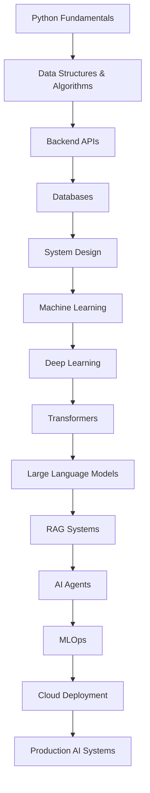

<!-- ========================================================= -->
<!--                     GITHUB PROFILE README                 -->
<!-- ========================================================= -->

<p align="center">
  
</p>

<p align="center">
  
</p>

<p align="center">
  <a href="https://github.com/YOUR_GITHUB_USERNAME">
    
  </a>
  <a href="https://linkedin.com/in/YOUR_LINKEDIN_USERNAME">
    
  </a>
  <a href="https://YOUR_PORTFOLIO_LINK">
    
  </a>
  <a href="mailto:YOUR_EMAIL">
    
  </a>
</p>

<p align="center">
  
  
  
</p>

---

##  About Me

```txt
AI Engineer in progress.
Backend systems thinker.
LLM, agent, and automation builder.
Focused on production-grade engineering, not just demos.
```

I am a future-focused **AI Engineer** building strong foundations in **Machine Learning, Deep Learning, LLMs, AI Agents, Backend Engineering, and Production AI Systems**.

My goal is to become an engineer who can design, build, deploy, monitor, and scale intelligent systems that solve real-world problems.

> I believe great AI engineers do not only train models.  
> They understand systems, design reliable APIs, manage data, optimize inference, monitor failures, and build products that users can actually trust.

---

## 🧠 Core Focus Areas

<table>
<tr>
<td width="50%" valign="top">

### 🤖 Artificial Intelligence

- Machine Learning
- Deep Learning
- Natural Language Processing
- Large Language Models
- Generative AI
- AI Agents
- Multi-Agent Systems
- Prompt Engineering
- Fine-Tuning
- Embeddings
- Vector Search
- RAG Pipelines
- AI Automation

</td>
<td width="50%" valign="top">

### ⚙️ Backend Engineering

- REST APIs
- FastAPI
- Node.js
- Express.js
- Authentication
- Authorization
- Database Design
- Caching
- Message Queues
- Microservices
- Clean Architecture
- Scalable System Design
- Production APIs

</td>
</tr>
</table>

<table>
<tr>
<td width="50%" valign="top">

### ☁️ MLOps & Deployment

- Model Serving
- Docker
- CI/CD
- Monitoring
- Logging
- Evaluation Pipelines
- Dataset Versioning
- Experiment Tracking
- Cloud Deployment
- Inference Optimization

</td>
<td width="50%" valign="top">

### 🧩 Engineering Mindset

- First-Principles Thinking
- Clean Code
- System Design
- Tradeoff Analysis
- Debugging
- Observability
- Reliability
- Security
- Product Thinking
- Continuous Learning

</td>
</tr>
</table>

---

## 🛠️ Tech Stack

### 👨‍💻 Languages

<p>
  
</p>

<p>
  
  
</p>

---

### 🤖 AI / ML / Data Science

<p>
  
</p>

<p>
  
  
  
  
  
</p>

---

### ⚙️ Backend & APIs

<p>
  
</p>

<p>
  
  
  
</p>

---

### 🗄️ Databases & Storage

<p>
  
</p>

<p>
  
  
</p>

---

### ☁️ DevOps, Cloud & Tools

<p>
  
</p>

<p>
  
  
  
</p>

---

## 📚 Currently Learning

```yaml
AI Engineering:
  - Machine Learning Fundamentals
  - Deep Learning with PyTorch
  - Transformer Architecture
  - LLM Application Development
  - Retrieval-Augmented Generation
  - AI Agent Orchestration
  - Multi-Agent Systems
  - LLM Evaluation
  - Inference Optimization

Backend Engineering:
  - FastAPI Production Patterns
  - REST API Design
  - Authentication and Authorization
  - Database Schema Design
  - PostgreSQL Internals
  - Redis Caching
  - Message Queues
  - Microservices
  - Distributed Systems
  - Scalable System Design

MLOps and Deployment:
  - Docker
  - CI/CD Pipelines
  - Model Serving
  - Monitoring
  - Logging
  - Cloud Deployment
  - Experiment Tracking
  - Evaluation Pipelines
```

---

## 🚀 Featured Project Ideas

<table>
<tr>
<td width="50%" valign="top">

## 🤖 AI Agent Automation System

An intelligent automation system using LLMs, tools, APIs, memory, and workflow orchestration to complete multi-step tasks.

### Tech Stack

```txt
Python · FastAPI · LangGraph · OpenAI API
PostgreSQL · Redis · Docker · GitHub Actions
```

### Features

- Tool calling
- Multi-step planning
- Long-term memory
- API integrations
- Background jobs
- Agent workflow orchestration
- Logging and monitoring
- Evaluation support

</td>
<td width="50%" valign="top">

## 📚 RAG Knowledge Assistant

A document-based AI assistant that answers questions from PDFs, notes, and private knowledge bases using retrieval-augmented generation.

### Tech Stack

```txt
Python · FastAPI · Vector DB · Embeddings
LLMs · PostgreSQL · Docker
```

### Features

- PDF ingestion
- Text chunking
- Embedding generation
- Semantic search
- Source-grounded answers
- Query rewriting
- RAG evaluation pipeline
- Document management

</td>
</tr>

<tr>
<td width="50%" valign="top">

## ⚙️ ML Model API

A production-style machine learning API that exposes model predictions through clean REST endpoints.

### Tech Stack

```txt
Python · Scikit-learn · FastAPI
Docker · PostgreSQL · Pydantic
```

### Features

- Model training pipeline
- REST inference endpoint
- Input validation
- Error handling
- Logging
- Model versioning
- Dockerized deployment
- API documentation

</td>
<td width="50%" valign="top">

## 🧠 AI Research Assistant

An AI assistant for summarizing papers, extracting concepts, comparing methods, and creating structured study notes.

### Tech Stack

```txt
LLMs · RAG · Python · FastAPI
Vector DB · Streamlit · Embeddings
```

### Features

- Research paper summarization
- Concept extraction
- Method comparison
- Citation-aware answers
- Study note generation
- Paper search workflow
- Knowledge base creation

</td>
</tr>
</table>

---

## 🧩 Engineering Principles

```txt
01. Understand the problem before writing code.
02. Build simple systems before complex systems.
03. Write readable, testable, maintainable code.
04. Design APIs before implementing features.
05. Prefer reliability over cleverness.
06. Measure performance before optimizing.
07. Make systems observable with logs and metrics.
08. Secure systems by default.
09. Automate repetitive work.
10. Build real projects, not only tutorials.
11. Learn fundamentals deeply.
12. Ship, get feedback, and improve.
```

---

## 🏗️ My AI Engineering Roadmap



---

## 📊 GitHub Analytics

<p align="center">
  
  
</p>

<p align="center">
  
</p>

---

## 🏆 GitHub Trophies

<p align="center">
  
</p>

---

## 📈 Contribution Activity

<p align="center">
  
</p>

---

## 🔥 What I Am Building Toward

```txt
A strong engineering portfolio with real, production-style projects:

01. AI Agent Automation Platform
02. RAG Knowledge Assistant
03. ML Model Serving API
04. Backend Microservice System
05. Data Science Portfolio
06. LLM Evaluation Toolkit
07. AI Workflow Automation Tool
08. System Design Notes Repository
09. MLOps Deployment Pipeline
10. Open-Source AI Engineering Tools
```

---

## 🧪 Areas I Practice

<table>
<tr>
<td width="33%" valign="top">

### AI Systems

- RAG
- Agents
- Tool Calling
- Memory
- Embeddings
- Evaluation
- Fine-Tuning
- Inference

</td>
<td width="33%" valign="top">

### Backend Systems

- APIs
- Auth
- Databases
- Caching
- Queues
- Microservices
- Clean Architecture
- Performance

</td>
<td width="33%" valign="top">

### Production Skills

- Docker
- CI/CD
- Logging
- Monitoring
- Testing
- Cloud
- Security
- Deployment

</td>
</tr>
</table>

---

## 📝 Learning Notes

I use GitHub to document my learning journey in AI engineering and backend development.

```txt
01. Python for Production Systems
02. FastAPI Backend Development
03. SQL and Database Design
04. Machine Learning Fundamentals
05. Deep Learning with PyTorch
06. Transformer Architecture
07. LLM Application Development
08. RAG System Design
09. AI Agents and Tool Calling
10. Docker and Deployment
11. System Design for AI Products
12. MLOps and Model Monitoring
```

---

## 🤝 Open To Collaborate On

<p>
  
  
  
  
  
  
</p>

I am interested in collaborating on:

- AI agent systems
- LLM-powered applications
- RAG-based assistants
- Backend APIs for AI products
- Workflow automation platforms
- ML deployment projects
- Developer productivity tools
- Open-source AI engineering projects

---

## 📌 Pinned Repository Strategy

To make this profile stronger, I want my pinned repositories to show practical engineering depth:

```txt
1. AI Agent Automation System
2. RAG Knowledge Assistant
3. ML Model API
4. FastAPI Backend Project
5. Data Science Portfolio
6. System Design Notes
```

Each project should include:

```txt
README.md
Architecture Diagram
API Documentation
Setup Instructions
Environment Variables
Docker Support
Example Requests
Testing Instructions
Production Notes
```

---

## ⚡ Developer Mindset

```txt
Learn deeply.
Build consistently.
Ship publicly.
Improve daily.
Think in systems.
Solve real problems.
```

---

## 💡 Quote I Follow

> Great engineers do not just write code.  
> They understand systems, design tradeoffs, solve problems, and build things that last.

---

## 📫 Connect With Me

<p align="center">
  <a href="https://github.com/YOUR_GITHUB_USERNAME">
    
  </a>
  <a href="https://linkedin.com/in/YOUR_LINKEDIN_USERNAME">
    
  </a>
  <a href="https://YOUR_PORTFOLIO_LINK">
    
  </a>
  <a href="mailto:YOUR_EMAIL">
    
  </a>
</p>

---

<p align="center">
  
</p>
