<!-- ========================================================= -->
<!--                  SUBRAMANIAN K | GITHUB PROFILE        -->
<!--       AI Engineer • Backend Developer • Agent Builder      -->
<!-- ========================================================= -->

<!-- Replace these placeholders before publishing:
  YOUR_GITHUB_USERNAME
  YOUR_LEETCODE_USERNAME
  YOUR_LINKEDIN_USERNAME
  YOUR_PORTFOLIO_LINK
  YOUR_EMAIL
-->

<p align="center">
  
</p>

<p align="center">
  
</p>

<p align="center">
  <a href="https://github.com/YOUR_GITHUB_USERNAME">
    
  </a>
  <a href="https://linkedin.com/in/YOUR_LINKEDIN_USERNAME">
    
  </a>
  <a href="https://YOUR_PORTFOLIO_LINK">
    
  </a>
  <a href="mailto:YOUR_EMAIL">
    
  </a>
</p>

<p align="center">
  
  
  
</p>

<br />

<table align="center">
<tr>
<td width="55%" valign="top">

## 👋 About Me

I am an **AI Engineer in progress** focused on building reliable, production-style systems using **Machine Learning, Deep Learning, LLMs, AI Agents, Backend Engineering, and MLOps**.

My goal is to design, build, deploy, monitor, and scale intelligent applications that solve real-world problems — not just demos.

```txt
AI Engineer in progress
Backend systems thinker
LLM, RAG, and agent builder
Focused on production-grade engineering
```

</td>
<td width="45%" valign="top">

## 🎯 Current Direction

```yaml
Primary Focus:
  - AI Agents and Automation
  - RAG and LLM Applications
  - Backend APIs and Databases
  - Production ML Systems
  - System Design and MLOps

Engineering Values:
  - Reliability
  - Clean Architecture
  - Observability
  - Security
  - Continuous Shipping
```

</td>
</tr>
</table>

---

## 🧠 Engineering Focus

<table>
<tr>
<td width="25%" valign="top" align="center">

### 🤖 AI Systems

ML/DL  
LLMs  
RAG  
Agents  
Embeddings  
Evaluation

</td>
<td width="25%" valign="top" align="center">

### ⚙️ Backend

REST APIs  
FastAPI  
Node.js  
Auth  
Caching  
Microservices

</td>
<td width="25%" valign="top" align="center">

### 🗄️ Data

PostgreSQL  
MongoDB  
Redis  
Vector DBs  
Pipelines  
Analytics

</td>
<td width="25%" valign="top" align="center">

### 🚀 MLOps

Docker  
CI/CD  
Serving  
Monitoring  
Logging  
Cloud

</td>
</tr>
</table>

---

## 🛠️ Tech Arsenal

<div align="center">

### Languages


<br />
<br />


### AI / ML / Data Science


<br />
<br />


### Backend, Databases & DevOps


<br />
<br />


</div>

---

## 🚀 Featured Projects

<table>
<tr>
<td width="50%" valign="top">

### 🤖 AI Agent Automation Platform

A production-style agent system that uses LLMs, tools, APIs, memory, and workflow orchestration to complete multi-step tasks.

**Tech:** Python · FastAPI · LangGraph · PostgreSQL · Redis · Docker  
**Focus:** Tool calling · Planning · Memory · Observability · Evaluation

<a href="https://github.com/YOUR_GITHUB_USERNAME/ai-agent-automation-platform">
  
</a>

</td>
<td width="50%" valign="top">

### 📚 RAG Knowledge Assistant

A document-grounded AI assistant that answers from PDFs, notes, and private knowledge bases using retrieval-augmented generation.

**Tech:** Python · FastAPI · Vector DB · Embeddings · LLMs · Docker  
**Focus:** Ingestion · Chunking · Semantic Search · Citations · Evaluation

<a href="https://github.com/YOUR_GITHUB_USERNAME/rag-knowledge-assistant">
  
</a>

</td>
</tr>
<tr>
<td width="50%" valign="top">

### ⚙️ ML Model Serving API

A clean REST API for serving ML predictions with validation, logging, versioning, and Dockerized deployment.

**Tech:** Python · Scikit-learn · FastAPI · Pydantic · Docker · PostgreSQL  
**Focus:** Model serving · Input validation · Versioning · API documentation

<a href="https://github.com/YOUR_GITHUB_USERNAME/ml-model-serving-api">
  
</a>

</td>
<td width="50%" valign="top">

### 🧠 AI Research Assistant

An AI assistant for summarizing papers, extracting concepts, comparing methods, and generating structured study notes.

**Tech:** LLMs · RAG · Python · FastAPI · Streamlit · Vector DB  
**Focus:** Paper analysis · Method comparison · Notes · Research workflows

<a href="https://github.com/YOUR_GITHUB_USERNAME/ai-research-assistant">
  
</a>

</td>
</tr>
</table>

---

## 🧩 LeetCode & Problem Solving

<table>
<tr>
<td width="50%" valign="top">

### 🔥 DSA Practice

```txt
Core Topics:
Arrays · Strings · Hashing · Two Pointers
Stacks · Queues · Trees · Graphs
Dynamic Programming · Greedy · Backtracking
Binary Search · Sliding Window · Heaps
```

</td>
<td width="50%" valign="top" align="center">


</td>
</tr>
</table>

---

## 📊 GitHub Analytics

<p align="center">
  
  
</p>

<p align="center">
  
  
</p>

<p align="center">
  
</p>

---

## 🏗️ AI Engineering Roadmap

```mermaid
graph LR;
    A[Python] --> B[DSA]
    B --> C[Backend APIs]
    C --> D[Databases]
    D --> E[System Design]
    E --> F[Machine Learning]
    F --> G[Deep Learning]
    G --> H[Transformers]
    H --> I[LLM Apps]
    I --> J[RAG]
    J --> K[AI Agents]
    K --> L[MLOps]
    L --> M[Production AI Systems]
```



---

## 📌 Portfolio Strategy

<table>
<tr>
<td width="33%" valign="top">

### Must-Have Repos

- AI Agent Platform
- RAG Assistant
- ML Serving API
- Backend API System
- Data Science Portfolio
- System Design Notes

</td>
<td width="33%" valign="top">

### Every Repo Should Have

- Architecture diagram
- Setup instructions
- API documentation
- Environment variables
- Docker support
- Test instructions
- Production notes

</td>
<td width="33%" valign="top">

### What It Proves

- Engineering maturity
- System design thinking
- Deployment ability
- Clean code habits
- Problem solving
- Real-world readiness

</td>
</tr>
</table>

---

## 🤝 Open To Collaborate On

<div align="center">


</div>

<br />

<table align="center">
<tr>
<td align="center" width="33%">

### Build

AI products, APIs, automations, and practical tools.

</td>
<td align="center" width="33%">

### Learn

System design, AI engineering, MLOps, and scalable architecture.

</td>
<td align="center" width="33%">

### Ship

Useful projects publicly with documentation and deployment.

</td>
</tr>
</table>

---

## ⚡ Developer Mindset

```txt
Learn deeply. Build consistently. Ship publicly.
Think in systems. Measure tradeoffs. Solve real problems.
```

> Great engineers do not just write code.  
> They understand systems, design tradeoffs, solve problems, and build things that last.

---

## 📫 Connect With Me

<p align="center">
  <a href="https://github.com/YOUR_GITHUB_USERNAME">
    
  </a>
  <a href="https://linkedin.com/in/YOUR_LINKEDIN_USERNAME">
    
  </a>
  <a href="https://YOUR_PORTFOLIO_LINK">
    
  </a>
  <a href="mailto:YOUR_EMAIL">
    
  </a>
</p>

<p align="center">
  <b>Thanks for visiting my profile. Let's build something useful.</b>
</p>

<p align="center">
  
</p>
