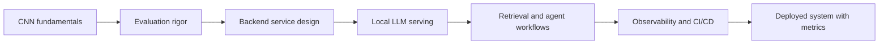

[Capabilities](#capabilities) · [AI Stack](#ai-stack) · [Architecture](#architecture) · [Projects](#projects) · [Research](#research) · [Roadmap](#roadmap) · [Open Source](#open-source) · [Contact](#contact)

## Capabilities

## AI Stack

## Architecture

| Decision | Rationale | Trade-off |
|---|---|---|
| Local LLM inference (Ollama) | Patient data stays inside the boundary | Lower model quality and higher hardware cost than hosted APIs |
| Separate frontend and backend repositories | Independent releases, explicit API contract | Contract drift unless versioned and tested |
| Capacity target under 1,000 users | A modular monolith is sufficient | Revisit if concurrency or tenancy grows |

## Projects

| Project | Status | Engineering focus |
|---|---|---|
| **Hospital ERP / HIS** | Architecture phase, team of 3 | Azure topology, local LLM service, API contracts, access control |
| **Handwriting Recognition CNN** | Training and tuning, target 80%+ test accuracy | Data pipeline, augmentation, evaluation methodology |
| **Video Editing Automation** | Requirements gathering | Replacing manual edit steps with a repeatable pipeline |

## Research

| Question | Method | Result |
|---|---|---|
| What accuracy ceiling does a small CNN reach on the handwriting set? | Baseline, then augmentation and regularization sweeps | In progress |
| What does local inference cost in latency and quality versus hosted models? | Fixed prompt benchmark on local models | Planned |

## Roadmap

```mermaid
graph LR
    A[CNN fundamentals] --> B[Evaluation rigor]
    B --> C[Backend service design]
    C --> D[Local LLM serving]
    D --> E[Retrieval and agent workflows]
    E --> F[Observability and CI/CD]
    F --> G[Deployed system with metrics]
```

## Open Source

<picture>
  <source media="(prefers-color-scheme: dark)" srcset="https://raw.githubusercontent.com/subramanian-sk22/subramanian-sk22/output/github-snake-dark.svg"/>
  
</picture>

## Contact

