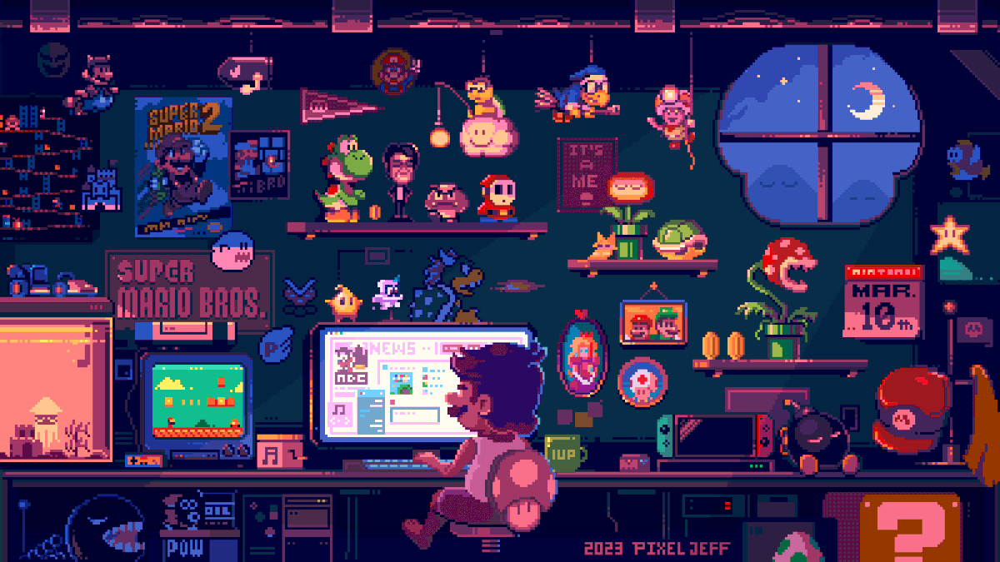

<!-- Replace this file with your preferred animated header GIF:
     img/header.gif
-->

<h1>SUBRAMANIAN KARTHIKEYAN</h1>

<h3>Student · AI/ML · Data Science · Software Engineering</h3>

  <em>Curious by nature, practical by design — I learn by building things that solve real problems.</em> 
  I turn ideas, data and experiments into useful software.

  
  
  

  <a href="#about"><b>About</b></a> &nbsp;•&nbsp;
  <a href="#building"><b>Building</b></a> &nbsp;•&nbsp;
  <a href="#stack"><b>Stack</b></a> &nbsp;•&nbsp;
  <a href="#activity"><b>Activity</b></a> &nbsp;•&nbsp;
  <a href="#projects"><b>Projects</b></a> &nbsp;•&nbsp;
  <a href="#faq"><b>FAQ</b></a> &nbsp;•&nbsp;
  <a href="#connect"><b>Connect</b></a>

  
  

<table>
  <tr>
    <td align="right"><b>🎯 Focus</b></td>
    <td align="left">AI/ML · Data Science · Intelligent Applications</td>
  </tr>
  <tr>
    <td align="right"><b>🔨 Building</b></td>
    <td align="left">Practical AI, automation and software projects</td>
  </tr>
  <tr>
    <td align="right"><b>📚 Learning</b></td>
    <td align="left">Machine Learning · Deep Learning · LLMs · Automation</td>
  </tr>
  <tr>
    <td align="right"><b>💬 Ask me about</b></td>
    <td align="left">Python · AI/ML · Computer Vision · Data Science</td>
  </tr>
</table>

👋 About Me

I'm Subramanian Karthikeyan, a student and technology enthusiast focused on AI/ML, Data Science and software development.

I enjoy taking a problem from an idea on paper to something that can actually run — experimenting with models, writing Python, working with data, and turning technical concepts into usable projects.

🧠 Interested in: Artificial Intelligence, Machine Learning, Computer Vision and Data Science

🐍 Primary language: Python

🔬 Learning through: Projects, experiments and hands-on development

⚙️ Building toward: Intelligent applications and practical automation

🚀 Mindset: Learn → Build → Test → Improve

🚀 Currently Building

<table>
  <tr>
    <td width="50%" valign="top">

🧠 AI / ML Projects

Exploring machine-learning and deep-learning solutions with Python, datasets and real-world problems.

Focus — Model development · Computer Vision · Recognition systems

</td>
    <td width="50%" valign="top">

⚙️ Automation & Software

Experimenting with automation workflows and software systems that reduce repetitive work.

Focus — Python · APIs · Intelligent workflows

</td>
  </tr>
</table>

🧰 Tech Stack

Languages

AI / ML

Web / Backend

Databases

Dev Tools

📊 GitHub Analytics

 

  
  

<b>📈 Repository snapshot</b> — click to expand

 

🐍 Contribution Flow

<picture>
  <source media="(prefers-color-scheme: dark)" srcset="https://raw.githubusercontent.com/subramanian-sk22/subramanian-sk22/output/github-snake-dark.svg">
  <source media="(prefers-color-scheme: light)" srcset="https://raw.githubusercontent.com/subramanian-sk22/subramanian-sk22/output/github-snake.svg">
  
</picture>

⭐ Projects

A growing collection of experiments, applications and ideas built while learning.

🔍 What I Build Around

AI / ML
 ├── Model experiments
 ├── Computer vision
 ├── Image & pattern recognition
 └── Deep learning

Software
 ├── Python applications
 ├── Automation
 ├── APIs & backend systems
 └── Practical developer tools

🏆 Achievements

Keeping this section focused on verifiable achievements rather than placeholder claims.

🎓 Student developer building a practical portfolio across AI/ML and software development

🧪 Hands-on learner working with machine learning, deep learning and computer vision

🚀 Project-driven development — learning technologies by building and experimenting

🌱 Current Learning

A roadmap, not a scoreboard.

🌱 Exploring → 🔨 Practicing → 🚢 Building

Topic

Stage

Direction

Machine Learning

🚢 Building

Practical model development

Deep Learning

🔨 Practicing

Neural networks and computer vision

LLMs & AI

🌱 Exploring

Modern AI applications and local models

Automation

🔨 Practicing

Intelligent workflows and developer tools

🧭 Philosophy

Stay curious. Build useful things. Learn from every iteration.

I prefer learning by turning concepts into working projects, testing what I build, and improving it one version at a time.

💡 FAQ

<b>What am I working on right now?</b>

 

I'm exploring AI/ML and software projects, with a focus on practical implementations rather than only theory.

<b>What technologies do I enjoy?</b>

 

Python is my main language, with a strong interest in machine learning, deep learning, computer vision, data science and automation.

<b>How do I learn?</b>

 

By building. I learn a concept, turn it into a project, test the result, debug what breaks and iterate.

<b>Am I open to collaboration?</b>

 

Yes — especially for interesting AI/ML, automation, software and open-source projects.

<b>Where can you find me?</b>

 

GitHub: <a href="https://github.com/subramanian-sk22">@subramanian-sk22</a> 
LinkedIn: <a href="https://www.linkedin.com/in/subramanian-sk/">Subramanian SK</a>

🔗 Connect

🤝 Open to

AI/ML collaboration · Software projects · Automation · Open source · Hackathons · Learning together

 

  

Learning is my cravings · Built with curiosity, code and continuous improvement.

